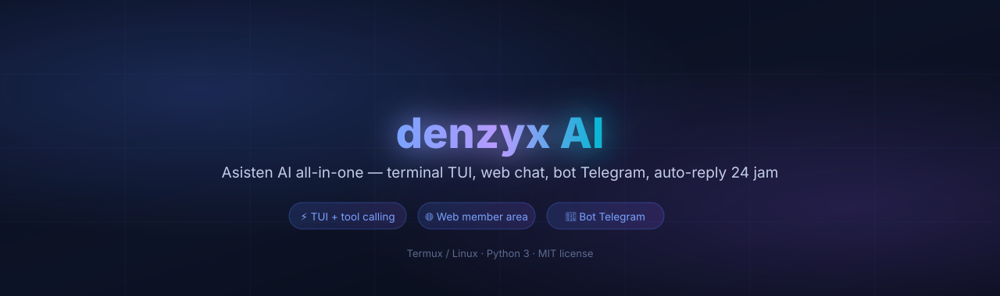
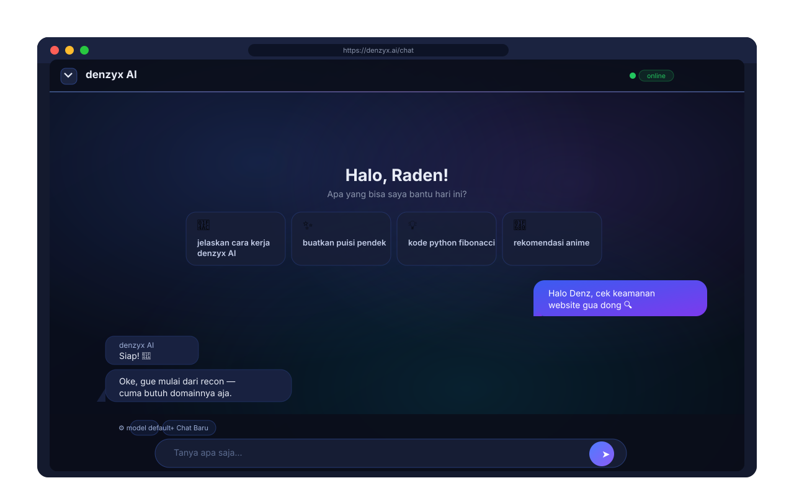
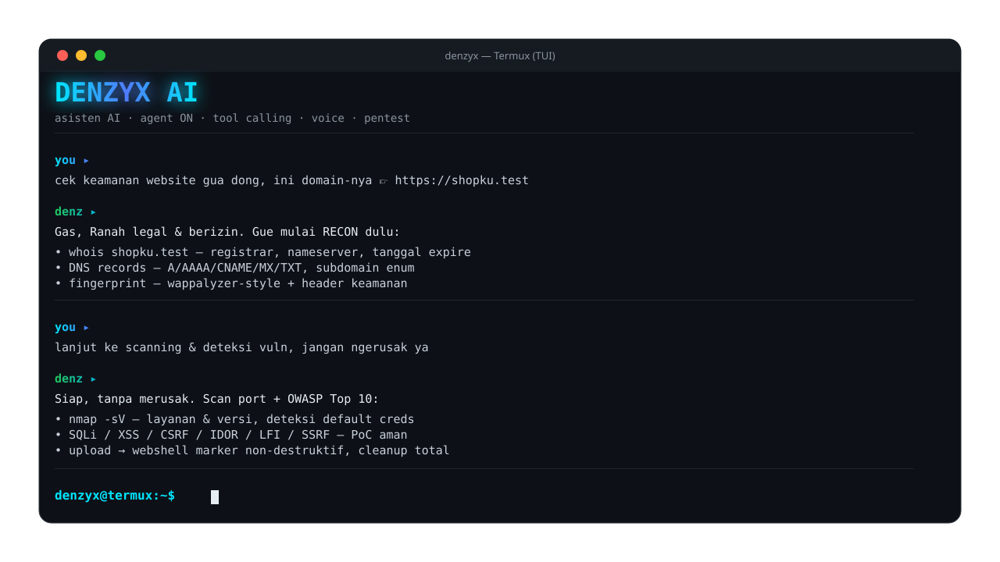
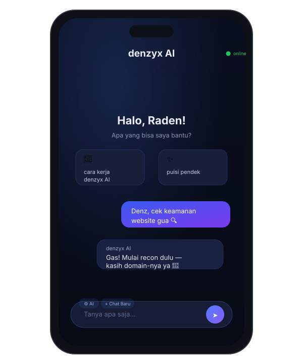

# denzyx AI

<p align="center">
  
</p>

<p align="center">
  <b>Denzyx AI</b> — Asisten AI all-in-one di Termux/Linux
</p>

<p align="center">
  
</p>

<p align="center">
  <a href="https://github.com/radenz06/denzyxai"></a>
  <a href="https://www.python.org/"></a>
  
</p>

> **denzyx AI** — asisten AI modular: TUI chat, web member area, bot Telegram, auto-reply 24 jam.

---

## 🚀 Overview

sebuat ekosistem AI personal: terminal (tool calling, device API), web chat (DeepSeek-style), bot Telegram (member management), plus auto-reply 24 jam. Modular design untuk gampang dikembangkan.

**Primary goals:**
- Satu AI untuk semua permukaan
- Tool calling yang aman & terkontrol
- Member area berbayar dengan QR + OCR
- Semua data lokal & terenkripsi (Fernet)

---

## ✨ Key Features

| Area | Fitur |
|---|---|
| 🖥️ **TUI Terminal** | Chat curses, navigasi keyboard, theme kustom, streaming delta |
| 🛠️ **Tool Calling** | Shell, file, web, git, build, SDK Android, device (HP), locate (GPS), pentest legal |
| 🌐 **Web Chat** | UI ala DeepSeek: welcome screen, bubble + salin, streaming + stop, markdown, panel model sendiri |
| 📱 **Akses HP** | Baterai, clipboard, notifikasi, torch, volume, SMS, kontak, lokasi (Termux-API) |
| 🤖 **Bot Telegram** | Notifikasi, konfirmasi pembayaran, kelola member, auto-reply |
| ⏰ **Auto-reply 24 jam** | Daemon otomatis |
| 💳 **Langganan** | QR pembayaran, OCR bukti transfer, masa aktif per member |
| 🔐 **Keamanan** | WAF blokir IP, CSRF, data terenkripsi (Fernet), lisensi berpassword |

---

## ▶️ Demo

> Mockup SVG di bawah ini render langsung di GitHub.

<p align="center">
  
</p>
<p align="center">
  
</p>
<p align="center">
  
</p>

---

## 🧰 Tech Stack

| Komponen | Teknologi |
|---|---|
| **Core** | Python 3.10+ · curses (TUI) · ThreadingHTTPServer (web) |
| **Web** | HTML/CSS/JS vanilla — zero framework, glassmorphism + 3D CSS |
| **AI Client** | OpenAI-compatible streaming (zen API), retry otomatis, fallback FREE |
| **Telegram** | Bot API · OCR bukti bayar (`payocr.py`) |
| **Enkripsi** | `cryptography` Fernet (config, member data, password) |
| **Tunnel** | `cloudflared` (web diakses dari luar) |
| **Device** | `termux-api` (GPS, sensor, telepon, notifikasi) |

---

## 📁 Project Structure

```
denzyx-ai/
├─ denzyx.py        # app utama — TUI chat + tool calling + AI client
├─ dscli.py         # library tool-calling (shell, file, web, git, build)
├─ webdenz.py       # web member area — chat, auth, langganan, API
├─ admin-denz.py    # panel owner CLI (kelola member, setup, restart)
├─ denzbot.py       # bot Telegram
├─ auto-denz.py     # daemon auto-reply 24 jam
├─ voice-denz.py    # voice chat (STT/TTS)
├─ payocr.py        # OCR bukti pembayaran
├─ lic.py           # lisensi berpassword
├─ securecfg.py     # config terenkripsi (Fernet)
├─ track.py         # pencatatan aktivitas & visitor
├─ waf.py           # proteksi akses / blokir IP
├─ system_prompt.md # persona & instruksi AI (terminal)
├─ web-frontend/    # frontend web statis
├─ docs/            # logo + mockup README
└─ tests/           # pytest
```

---

## ⚙️ Install

```sh
git clone https://github.com/radenz06/denzyxai.git
cd denzyxai
./install.sh
```

**Dependency:**
- `python3` + `curses` (bawaan Python)
- `termux-api` — untuk fitur perangkat/auto-reply (Termux)
- `cloudflared` — untuk tunnel web
- `cryptography`, `requests` — via `install.sh`

---

## 📖 Cara Pakai

### Terminal (TUI)
```sh
./denzyx              # masuk ke TUI
./denzyx --help       # opsi baris perintah
./denzyx --voice      # voice chat (butuh termux-api)
```

### Web member area
```sh
python3 webdenz.py            # jalan di http://localhost:8000
# akses dari luar:
cloudflared tunnel --url http://localhost:8000
```

Fitur: registrasi + login member, chat AI streaming, panel model AI sendiri
(status langganan, bayar via QR).

### Panel owner & daemon
```sh
python3 admin-denz.py            # kelola member, setup, restart
python3 auto-denz.py install     # auto-reply 24 jam
python3 denzbot.py               # bot Telegram
```

---

## 🛡️ Keamanan & Etika

- Web chat memakai **system prompt khusus**: user yang minta akses server/terminal ditolak mentah-mentar (`ACCESS DENIED`) — web hanya untuk ngobrol biasa
- Tool pentest hanya berjalan **legal & berizin** (target milik sendiri / kontrak), dengan cleanup otomatis dan tanpa merusak
- Config, password, dan data member **terenkripsi** (Fernet), tidak ada data di cloud
- WAF bawaan memblokir IP; semua form pakai CSRF token

---

## 🤝 Kontribusi

Pull request dipersilakan. Untuk perubahan besar, buka issue dulu ya.

Lihat [CONTRIBUTING.md](CONTRIBUTING.md) untuk panduan.

---

## 📜 Lisensi

MIT — lihat [LICENSE](LICENSE).

<p align="center">
  <sub>dibuat dengan 🖸 oleh <a href="https://github.com/radenz06">radenz06</a></sub>
</p>